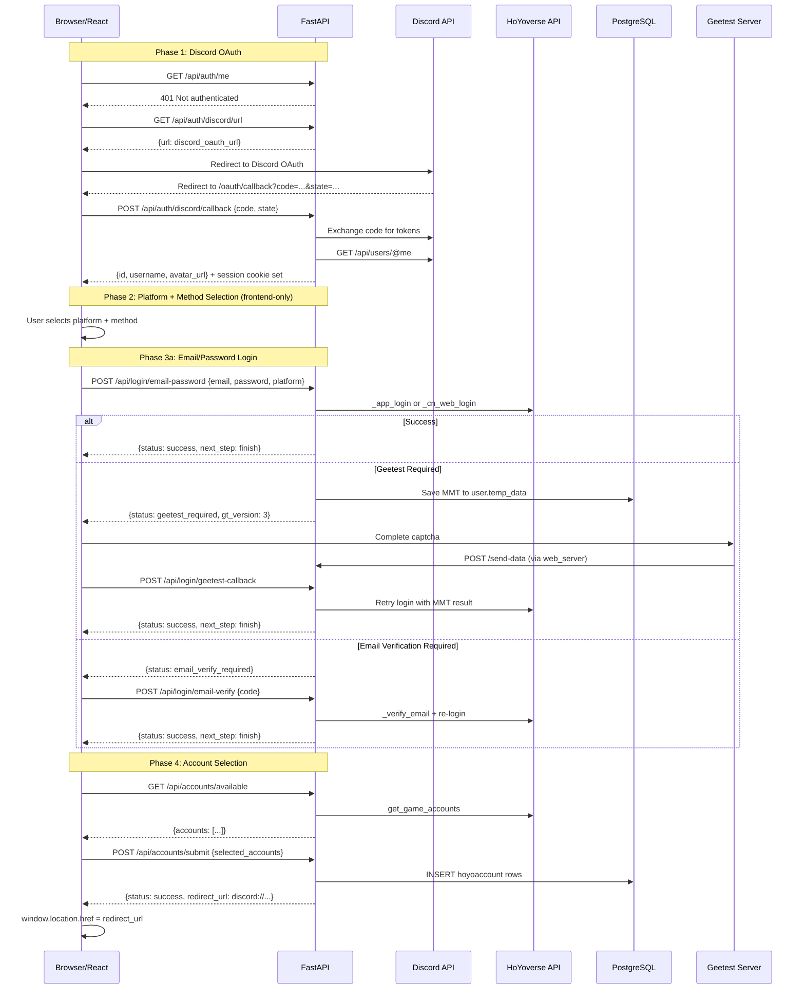

# Flet → FastAPI Migration Plan

## Overview

Replace the Flet-based web app (`hoyo_buddy/web_app/`) with a FastAPI JSON API backend in this repo, and a React + Vite frontend in a separate repo. Session management uses `itsdangerous` signed cookies.

---

## Current Architecture Summary

### Entry Point
- `run_web_app.py` — Flet exports an ASGI app via `ft.app(export_asgi_app=True)`, runs via uvicorn on `CONFIG.web_app_port`

### Two Subsystems
1. **Login System** — Discord OAuth → platform selection → login method → HoYoverse auth → account selection → save to DB
2. **Gacha Log System** — Paginated gacha history viewer (no auth required)

### State Currently in Flet `client_storage` (browser localStorage bridge)

| Key | Sensitivity | New Location |
|-----|------------|--------------|
| `hb.oauth_access_token` | HIGH | Server session |
| `hb.oauth_refresh_token` | HIGH | Server session |
| `hb.oauth_state` | HIGH | Server session |
| `hb.original_route` | LOW | Server session |
| `hb.{user_id}.cookies` | HIGH | Server session (temp, during login flow) |
| `hb.{user_id}.email` | HIGH | Server session (temp, encrypted) |
| `hb.{user_id}.password` | HIGH | Server session (temp, encrypted) |
| `hb.{user_id}.mobile` | HIGH | Server session (temp, encrypted) |
| `hb.{user_id}.gt_type` | MEDIUM | Server session |
| `hb.{user_id}.params` | LOW | Server session |
| `hb.{user_id}.action_ticket` | HIGH | Server session |
| `hb.{user_id}.device_id` | LOW | React localStorage OR server session |
| `hb.{user_id}.device_fp` | LOW | React localStorage OR server session |
| `hb.gacha_icons` | NONE | API response caching (React query cache) |
| `hb.{locale}.{game}.gacha_names` | NONE | API response caching (React query cache) |

### Server-side Session (Flet `page.session`)

| Key | New Location |
|-----|-------------|
| `hb.user_id` | Server session (signed cookie) |

---

## Implementation Plan

### Task 1: Add FastAPI dependencies to `pyproject.toml`

**File**: `pyproject.toml`

Add these dependencies:
- `fastapi>=0.115.0`
- `python-multipart>=0.0.9`
- `itsdangerous>=2.2.0`
- `starlette>=0.41.0` (comes with fastapi, but pin for session middleware)

Note: `uvicorn` is already available (used by current Flet app). Remove `flet[web]==0.28.3` only at the end (Task 14).

---

### Task 2: Create session middleware using `itsdangerous`

**New file**: `hoyo_buddy/web_app/api/session.py`

Implement a Starlette-compatible session middleware using `itsdangerous.URLSafeTimedSerializer`:

```
Class: SignedCookieSessionMiddleware
- Constructor args: app, secret_key (use CONFIG.fernet_key), cookie_name="hb_session", max_age=86400*7, same_site="lax", https_only=True (prod) / False (dev)
- On request: deserialize session cookie → attach to request.state.session
- On response: if session was modified, serialize and set cookie
- Session data is a dict[str, Any] signed with itsdangerous (NOT encrypted — don't put raw passwords in it)
```

The session dict will hold:
- `user_id: int` — Discord user ID (set after OAuth)
- `oauth_access_token: str` — Discord access token
- `oauth_refresh_token: str` — Discord refresh token
- `oauth_state: str` — CSRF state for OAuth flow
- `original_route: str` — redirect target after login
- `login_flow: dict` — temp state for the multi-step login flow:
  - `encrypted_cookies: str`
  - `encrypted_email: str`
  - `encrypted_password: str`
  - `encrypted_mobile: str`
  - `gt_type: str`
  - `params: str`
  - `action_ticket: str`
  - `device_id: str`
  - `device_fp: str`

Create a FastAPI dependency:
```python
def get_session(request: Request) -> dict[str, Any]:
    return request.state.session
```

And an auth-required dependency:
```python
def require_auth(session: dict = Depends(get_session)) -> int:
    user_id = session.get("user_id")
    if user_id is None:
        raise HTTPException(401, "Not authenticated")
    return user_id
```

---

### Task 3: Create FastAPI app with CORS and session middleware

**New file**: `hoyo_buddy/web_app/api/app.py`

```python
from fastapi import FastAPI
from fastapi.middleware.cors import CORSMiddleware
from .session import SignedCookieSessionMiddleware
from hoyo_buddy.config import CONFIG

app = FastAPI(title="Hoyo Buddy Web API")

# Session middleware
app.add_middleware(
    SignedCookieSessionMiddleware,
    secret_key=CONFIG.fernet_key,
    https_only=CONFIG.env == "prod",
)

# CORS — allow the React frontend origin
allowed_origins = [
    "http://localhost:5173",  # Vite dev
    # Add production frontend URL here
]
app.add_middleware(
    CORSMiddleware,
    allow_origins=allowed_origins,
    allow_credentials=True,  # Required for session cookies
    allow_methods=["*"],
    allow_headers=["*"],
)

# Include routers (added in subsequent tasks)
```

---

### Task 4: Create database connection dependency

**New file**: `hoyo_buddy/web_app/api/deps.py`

Create an async dependency that provides an `asyncpg` connection (matching current pattern):

```python
async def get_db() -> AsyncGenerator[asyncpg.Connection, None]:
    conn = await asyncpg.connect(CONFIG.db_url)
    try:
        yield conn
    finally:
        await conn.close()
```

Also move the reusable, Flet-free helpers from `hoyo_buddy/web_app/utils.py`:
- `encrypt_string()`
- `decrypt_string()`
- `fetch_json_file()`
- `get_gacha_icon()`

These stay in `hoyo_buddy/web_app/utils.py` (they have no Flet dependency) or move to a shared module.

---

### Task 5: Create Pydantic schemas for API requests/responses

**New file**: `hoyo_buddy/web_app/api/schemas.py`

Reuse and extend the existing `hoyo_buddy/web_app/schema.py` models:

```
# Existing (keep as-is, they're already Flet-free):
- Params — login flow parameters
- GachaParams — gacha log query parameters

# New response schemas:
- AuthURLResponse: { url: str }
- UserResponse: { id: str, username: str, avatar_url: str }
- EmailPasswordRequest: { email: str, password: str }
- DevToolsCookiesRequest: { ltuid_v2: str, account_id_v2: str, ltoken_v2: str, ltmid_v2: str, account_mid_v2: str }
- RawCookiesRequest: { cookies: str }
- ModAppRequest: { login_details: str }
- MobileRequest: { mobile: str }
- OTPVerifyRequest: { code: str }
- EmailVerifyRequest: { code: str }
- DeviceInfoRequest: { device_info: str, aaid: str | None }
- AccountSubmitRequest: { selected_accounts: list[str] }  # list of "game_uid" strings
- LoginFlowResponse: { status: str, next_step: str, ... }  # polymorphic based on login result
- GachaLogResponse: { items: list[GachaItem], total: int, page: int, max_page: int }
- GachaItem: { id: int, item_id: int, rarity: int, num: int, num_since_last: int, wish_id: str, time: str, banner_type: int }
- GachaIconsResponse: { icons: dict[str, str] }
- GachaNamesResponse: { names: dict[str, str] }
- AccountInfo: { uid: int, nickname: str, game: str, server_name: str, level: int }
- FinishAccountsResponse: { accounts: list[AccountInfo] }
- QRCodeResponse: { ticket: str, image_base64: str }
- QRCodeStatusResponse: { status: str, cookies_saved: bool }
- ErrorResponse: { detail: str }
```

---

### Task 6: Implement auth router (`/api/auth/*`)

**New file**: `hoyo_buddy/web_app/api/routers/auth.py`

Three endpoints, ported from `login.py` and `app.py._handle_oauth()` and `app.py.fetch_user_data()`:

#### `GET /api/auth/me`
- Read `oauth_access_token` from session
- If missing → 401
- Call Discord `/api/users/@me`
- If token expired → try refresh with `oauth_refresh_token`
- Return `UserResponse`
- Source: `WebApp.fetch_user_data()` in `app.py:572-612`

#### `GET /api/auth/discord/url`
- Generate `state` with `secrets.token_urlsafe(32)`
- Store `state` in session
- Build Discord OAuth URL with redirect to frontend `/oauth/callback`
- Return `AuthURLResponse`
- Source: `LoginPage.on_login_button_click()` in `login.py:116-123`

#### `POST /api/auth/discord/callback`
- Accept `{ code: str, state: str }` body
- Validate `state` against session
- Exchange code for tokens at Discord
- Store tokens in session
- Fetch user data, set `user_id` in session
- Return `UserResponse`
- Source: `WebApp._handle_oauth()` in `app.py:614-673`

---

### Task 7: Implement login flow router (`/api/login/*`)

**New file**: `hoyo_buddy/web_app/api/routers/login.py`

This is the most complex router. The login flow is multi-step and stateful. The server session holds intermediate state under `session["login_flow"]`.

#### `POST /api/login/email-password`
- Accept `EmailPasswordRequest` + `platform` query param
- Call `ProxyGenshinClient._app_login()` or `._cn_web_login()`
- Handle result types:
  - `AppLoginResult` / `CNWebLoginResult` → save encrypted cookies in session, return `{ status: "success", next_step: "finish" }`
  - `SessionMMT` → save MMT data to DB `user.temp_data`, save gt_type/email/password to session, return `{ status: "geetest_required", next_step: "geetest", gt_version: 3 }`
  - `ActionTicket` → try send verification email → may trigger another SessionMMT or ActionTicket flow, return appropriate next_step
- Source: `EmailPassWordForm.on_submit()` + `handle_login_result()` in `email_password.py:238-256`, and `WebApp._handle_on_login()` in `app.py:119-188`

#### `POST /api/login/geetest-callback`
- Called after geetest is solved (user completes captcha, geetest server calls `/send-data`, then redirects user)
- Read `gt_type` from session
- Branch on gt_type: `on_login` → redo app_login with MMT result, `on_email_send` → redo email send, `on_otp_send` → redo OTP send
- Return next step
- Source: `WebApp._handle_geetest()` in `app.py:243-263`

#### `POST /api/login/email-verify`
- Accept `EmailVerifyRequest` (6-digit code)
- Verify email with `ProxyGenshinClient._verify_email()`
- Then re-login with ticket
- Save cookies to session
- Return `{ status: "success", next_step: "finish" }`
- Source: `EmailVerifyCodeButton.verify_code()` in `login_handler.py:170-216`

#### `POST /api/login/mobile-send-otp`
- Accept `MobileRequest`
- Call `ProxyGenshinClient._send_mobile_otp()`
- If `SessionMMT` → geetest required
- Otherwise → return `{ status: "otp_sent", next_step: "verify_otp" }`
- Source: `MobileNumberForm.on_submit()` in `mobile.py:52-75`

#### `POST /api/login/mobile-verify`
- Accept `OTPVerifyRequest`
- Call `ProxyGenshinClient._login_with_mobile_otp()`
- Save cookies to session
- Return `{ status: "success", next_step: "finish" }`
- Source: `MobileVerifyCodeButton.verify_code()` in `login_handler.py:282-306`

#### `POST /api/login/dev-tools`
- Accept `DevToolsCookiesRequest`
- Build cookie string, encrypt, save to session
- Return `{ status: "success", next_step: "finish" }`
- Source: `DevToolsCookieForm.on_submit()` in `dev_tools.py:108-132`

#### `POST /api/login/raw-cookies`
- Accept `RawCookiesRequest`
- Encrypt, save to session
- Return `{ status: "success", next_step: "finish" }`
- Source: `CookiesForm.on_submit()` in `dev_mode.py:62-76`

#### `POST /api/login/mod-app`
- Accept `ModAppRequest`
- Parse cookies, extract device_id/device_fp, save all to session
- Return `{ status: "success", next_step: "finish" }`
- Source: `LoginDetailForm.on_submit()` in `mod_app.py:103-123`

#### `POST /api/login/qrcode/create`
- Call `ProxyGenshinClient._create_qrcode()`
- Generate QR code image, return as base64
- Store ticket in session
- Return `QRCodeResponse`
- Source: `GenQRCodeButton.generate_qrcode()` in `qrcode.py:51-66`

#### `POST /api/login/qrcode/check`
- Read ticket from session
- Call `ProxyGenshinClient._check_qrcode()`
- If confirmed → save cookies to session
- Return `QRCodeStatusResponse`
- Source: `GenQRCodeButton.generate_qrcode()` polling loop in `qrcode.py:69-101`

#### `POST /api/login/device-info`
- Accept `DeviceInfoRequest`
- Parse JSON, generate device_fp if needed
- Save device_id and device_fp to session
- Return `{ status: "success", next_step: "finish" }`
- Source: `DeviceInfoForm.on_submit()` in `device_info.py:80-126`

---

### Task 8: Implement accounts router (`/api/accounts/*`)

**New file**: `hoyo_buddy/web_app/api/routers/accounts.py`

#### `GET /api/accounts/available`
- Read encrypted cookies from session
- Read device_id, device_fp from session
- Determine platform from session params
- If platform is MIYOUSHE and device info missing → return `{ status: "device_info_required" }`
- Optionally fetch cookie with stoken (same logic as `_handle_finish`)
- Call `ProxyGenshinClient.get_game_accounts()`
- Return `FinishAccountsResponse`
- Source: `WebApp._handle_finish()` in `app.py:294-383`

#### `POST /api/accounts/submit`
- Accept `AccountSubmitRequest` (list of "game_uid" strings)
- Read cookies, device_id, device_fp, platform from session
- Insert/update user, settings, hoyoaccount rows in DB
- Clear login flow from session
- Return `{ status: "success", redirect_url: "<discord_protocol_url>" }`
- Source: `SubmitButton.add_accounts_to_db()` in `finish.py:146-256`

---

### Task 9: Implement gacha router (`/api/gacha/*`)

**New file**: `hoyo_buddy/web_app/api/routers/gacha.py`

These endpoints require NO auth — they're accessed via direct URL from the Discord bot.

#### `GET /api/gacha/logs`
- Accept `GachaParams` as query params
- Validate account exists
- Query DB for gacha history + total count
- Return `GachaLogResponse`
- Source: `WebApp._handle_gacha_routes()` in `app.py:453-504`, `_get_gacha_logs()` in `app.py:539-558`, `_get_gacha_log_row_num()` in `app.py:516-526`

#### `GET /api/gacha/icons`
- Fetch Genshin character/weapon icons from ambr API
- Return `GachaIconsResponse`
- Source: `fetch_gacha_icons()` in `utils.py:186-205`

#### `GET /api/gacha/names`
- Accept `locale`, `game`, `item_ids` query params
- Fetch item names from appropriate data source
- Return `GachaNamesResponse`
- Source: `fetch_gacha_names()` in `utils.py:132-183`

---

### Task 10: Implement i18n endpoint

**New file**: `hoyo_buddy/web_app/api/routers/i18n.py`

The React frontend needs translation strings. Currently the Flet backend does `translator.translate()` inline.

#### `GET /api/i18n/{locale}`
- Return a JSON blob of all translation keys needed by the frontend for the given locale
- The frontend can cache this and use it for client-side rendering
- Source: the `translator` object from `hoyo_buddy/l10n/`

Alternatively, the frontend can import a static JSON export of translations. Decide which approach based on how many keys the frontend needs.

---

### Task 11: Register all routers in the FastAPI app

**Update file**: `hoyo_buddy/web_app/api/app.py`

```python
from .routers import auth, login, accounts, gacha, i18n

app.include_router(auth.router, prefix="/api/auth", tags=["auth"])
app.include_router(login.router, prefix="/api/login", tags=["login"])
app.include_router(accounts.router, prefix="/api/accounts", tags=["accounts"])
app.include_router(gacha.router, prefix="/api/gacha", tags=["gacha"])
app.include_router(i18n.router, prefix="/api/i18n", tags=["i18n"])
```

---

### Task 12: Update `run_web_app.py` to use FastAPI app

**Update file**: `run_web_app.py`

Replace the Flet app initialization with the new FastAPI app:

```python
import asyncio
import contextlib
import uvicorn
from hoyo_buddy.config import CONFIG
from hoyo_buddy.l10n import translator
from hoyo_buddy.utils import setup_async_event_loop, setup_logging, setup_sentry, wrap_task_factory
from hoyo_buddy.web_app.api.app import app


async def main() -> None:
    if CONFIG.web_app_port is None:
        msg = "Web app port is not configured in settings."
        raise RuntimeError(msg)

    wrap_task_factory()
    setup_logging("logs/web_app.log")
    setup_async_event_loop()
    setup_sentry(CONFIG.web_app_sentry_dsn)
    await translator.load()

    config = uvicorn.Config(
        app, host="localhost", port=CONFIG.web_app_port, log_config=None, log_level=None
    )
    server = uvicorn.Server(config)
    await server.serve()


if __name__ == "__main__":
    with contextlib.suppress(KeyboardInterrupt, asyncio.CancelledError):
        try:
            import uvloop
        except ImportError:
            asyncio.run(main())
        else:
            uvloop.run(main())
```

---

### Task 13: Update external references to web app URLs

**Files to update**:
- `hoyo_buddy/constants.py` — `WEB_APP_URLS` may need to point to the new frontend URL for user-facing redirects, while API URLs stay at the backend
- `hoyo_buddy/ui/account/items/add_acc_btn.py` — generates URL to `/platforms?...`, should point to React frontend
- `hoyo_buddy/ui/hoyo/gacha/view.py` — generates URL to `/gacha_log?...`, should point to React frontend
- `hoyo_buddy/web_server/server.py:158` — redirects to `/geetest?user_id=...`, should point to React frontend

Add a new config constant for the frontend URL:
```python
# In constants.py
WEB_APP_URLS = {  # Backend API
    "prod": "https://hb-api.seria.moe",
    "dev": "http://localhost:8000",
}
FRONTEND_URLS = {  # React frontend
    "prod": "https://hb-app.seria.moe",
    "dev": "http://localhost:5173",
}
```

Update all places that generate user-facing URLs to use `FRONTEND_URLS`, and all places that make API calls to use `WEB_APP_URLS`.

---

### Task 14: Remove Flet dependency and delete old files

**Delete files**:
- `hoyo_buddy/web_app/pages/` (entire directory)
- `hoyo_buddy/web_app/app.py` (the Flet WebApp class)
- `hoyo_buddy/web_app/login_handler.py` (Flet UI components — business logic already ported to routers)

**Modify files**:
- `hoyo_buddy/web_app/utils.py` — remove all `ft.*` imports and Flet-dependent classes (`LoadingSnackBar`, `ErrorBanner`, `show_loading_snack_bar`, `show_error_banner`, `clear_storage`, `refresh_page_view`). Keep: `encrypt_string`, `decrypt_string`, `fetch_json_file`, `fetch_gacha_icons`, `fetch_gacha_names` (refactored to not need `page` param), `get_gacha_icon`
- `pyproject.toml` — remove `flet[web]==0.28.3`

**Keep files**:
- `hoyo_buddy/web_app/schema.py` — already Flet-free, used by new API
- `hoyo_buddy/web_app/utils.py` — crypto helpers and data fetchers (cleaned)
- `hoyo_buddy/web_app/assets/` — static images, can be served by FastAPI `StaticFiles` if needed, or moved to frontend repo

---

## File Structure After Migration

```
hoyo_buddy/web_app/
├── api/
│   ├── __init__.py
│   ├── app.py              # FastAPI instance, middleware, router registration
│   ├── deps.py             # Dependencies: get_db, get_session, require_auth
│   ├── session.py          # SignedCookieSessionMiddleware using itsdangerous
│   ├── routers/
│   │   ├── __init__.py
│   │   ├── auth.py         # GET /api/auth/me, /discord/url, POST /discord/callback
│   │   ├── login.py        # POST /api/login/* (all login methods)
│   │   ├── accounts.py     # GET /api/accounts/available, POST /api/accounts/submit
│   │   ├── gacha.py        # GET /api/gacha/logs, /icons, /names
│   │   └── i18n.py         # GET /api/i18n/{locale}
│   └── schemas.py          # All Pydantic request/response models
├── schema.py               # Existing Params/GachaParams (kept)
├── utils.py                # Cleaned: crypto + data fetchers only
└── assets/                 # Static images
```

---

## Login Flow Sequence (Post-Migration)



---

## Geetest Flow Detail

The geetest flow involves the **separate `web_server`** (`hoyo_buddy/web_server/server.py`) which is a different process. The flow is:

1. FastAPI returns `{ status: "geetest_required" }` to React
2. React opens the geetest captcha page: `GEETEST_SERVERS[env]/captcha?user_id=...&gt_version=...&locale=...`
3. User solves captcha
4. Geetest page calls `POST /send-data` on the web_server → saves result to `user.temp_data` in DB
5. Geetest page redirects user to `FRONTEND_URLS[env]/geetest?user_id=...`
6. React `/geetest` page calls `POST /api/login/geetest-callback`
7. FastAPI reads the solved MMT from `user.temp_data` and retries the login

**Important**: The `web_server/server.py` redirect endpoint (line 158) must be updated to redirect to the React frontend URL instead of the Flet URL.

---

## Implementation Order for Code Agent

Execute tasks in this exact sequence:

1. **Task 2** — Session middleware (foundation, no deps on other new code)
2. **Task 5** — Pydantic schemas (needed by all routers)
3. **Task 4** — Database dependency + clean utils
4. **Task 3** — FastAPI app shell with middleware
5. **Task 9** — Gacha router (simplest, no auth, good for testing)
6. **Task 6** — Auth router (Discord OAuth)
7. **Task 7** — Login flow router (most complex, depends on session + auth)
8. **Task 8** — Accounts router (depends on login flow session state)
9. **Task 10** — i18n endpoint
10. **Task 11** — Register routers
11. **Task 12** — Update entry point
12. **Task 13** — Update external URL references
13. **Task 14** — Remove Flet (only after everything works)
